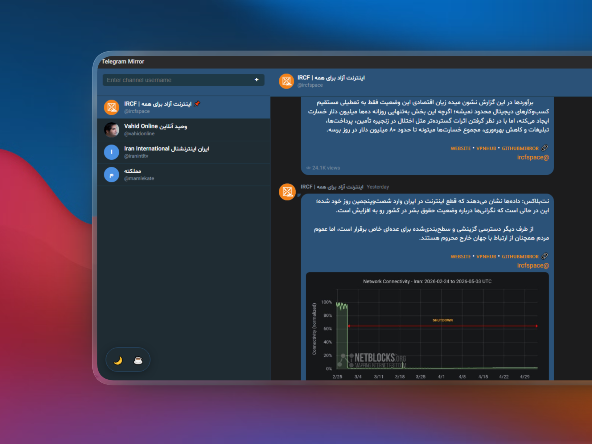

# teleMirror

teleMirror provides a reliable way to access Telegram channels in heavily filtered internet environments. By utilizing multiple bypass techniques and alternative data sources, it ensures consistent access to content even when direct Telegram connections are blocked.

## Features

- 👀 **No Telegram Required**: View channels without installing the official Telegram app
- 🔄 **Multi-Source Access**: Direct Telegram access + GitHub JSON backup for maximum reliability
- 🛡️ **Advanced Bypass**: Multiple proxy methods including Google Translate to circumvent filtering
- 🎨 **Clean Interface**: Modern UI optimized for content reading
- 💾 **Smart Caching**: Reduces requests and improves loading speed
- 📊 **Rich Content**: Display posts with views, and media previews
- 🌐 **Multi-Language Support**: Switch between Persian (Farsi) and English with a single click

## Downloads

Pre-built binaries are available for the following platforms and architectures:

| Platform | Architectures    |
| -------- | ---------------- |
| Windows  | x64, ia32, arm64 |
| Linux    | x64, arm64       |
| macOS    | x64, arm64       |

You can download the latest release from the [GitHub Releases](https://github.com/ircfspace/teleMirror/releases) page.

## Contributing

To contribute to the project:

1. Create a fork
2. Apply your changes in a new branch
3. Create a Pull Request

## License

This project is licensed under the MIT License.

## Donate

teleMirror is provided as a free and open-source application. If you find this project useful and would like to support its development, you can [make a donation](https://ircf.space/contacts.html#donate).
Your support helps us maintain and improve the project for everyone.

## Credits

- This project incorporates some methods and techniques inspired by ezyTel, which served as a reference for certain implementation approaches.
- The project also utilizes the [TeleFeed](https://github.com/ircfspace/teleFeed) repository as a backup data source for channel content.
